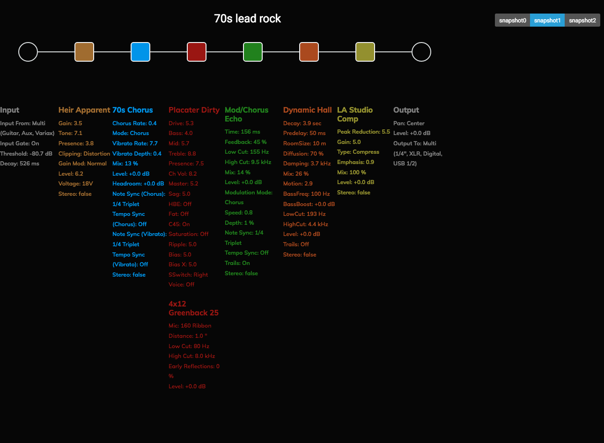
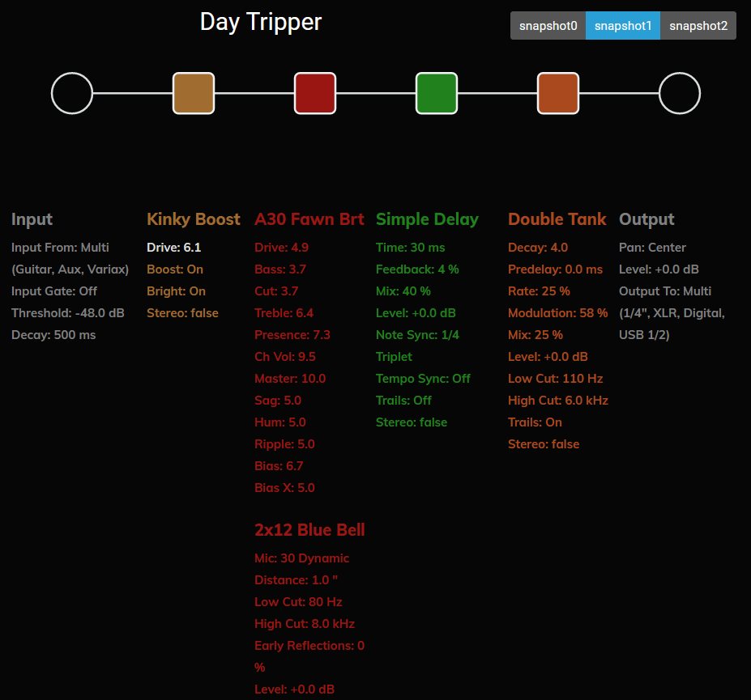
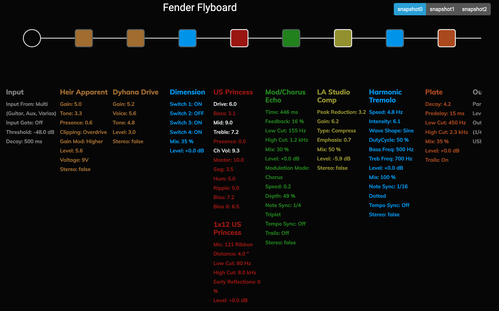

# HX Stomp Patch Library

These are patches we've created for use with the songs taught by Josh Skaja and The System. Learn more about the System [here](http://thesystem.rocks)

## May 2021

### Dream On - Aerosmith

Made this patch based on things we read on the web about Joe Perry's tone. He likely used a Marshall and a tube screamer. We used slightly more boutique-y versions of those: The Placater amp-sim simulates the [Friedman BE](https://friedmanamplification.com/heads/be-100-deluxe) which is a somehwat modified Plexi 800 and the Heir Apparent distortion pedal simulates the [Prince of Tone](https://www.buyanalogman.com/Analog_Man_Prince_of_Tone_overdrive_pedal_p/ampot.htm) which is a highly modified version of the TubeScreamer.

[Get the Patch](https://raw.githubusercontent.com/vanb/guitaros/master/tones/70s-lead-rock.hlx)

## April 2021

### 24k Magic - Bruno Mars

### Beat It - Michael Jackson

Used the [Fender Flyboard](#fenderFlyboard) for this one.

### Brain Stew - Green Day

To create this patch, I watched one Wampler Pedal's videos on getting this tone. They used the EVH 5150 pedal so we used the EVH Inspired amp called PV Panama Amp and the built in Noise Gate on the input.

[Hear the Patch](https://youtu.be/KQSmH7IojU0) (opens a YouTube Video)

[Get the Patch](https://raw.githubusercontent.com/vanb/guitaros/master/tones/brain-stew-patch.hlx)

**Reference**
https://www.youtube.com/watch?v=9JvHgrWF810

### Call me Maybe - Carly Rae Jepsen

### Day Tripper - The Beatles

The Day Tripper patch was inspired by an amazing Slack thread with our resident Beatles expert Michael Murray. Something we still want to work on is the voice doubling effect, ADT which we think is lightly used on this song. https://youtu.be/eCJZq3_rbaM (A great video on Beatles Guitar Tones)

[Hear the Patch](https://youtu.be/BnlIHUU-wmg) (opens a YouTube Video)

[Get the Patch](https://raw.githubusercontent.com/vanb/guitaros/master/tones/day-tripper.hlx)

### Master Blaster - Stevie Wonder

This patch is based on a Motown/Classic soul patch. We used the powerful 100w Mandarin Rocker, based on the Orange® Rockerverb 100 MKIII (Dirty Channel).
The idea was to use an amp with a lot of headroom so we could emulate the sound of playing into a recording studio console. The saturation and modulation
is provided by the Retro Reel modulation effect which emulates the sound of a reel-to-reel player. The Legacy Plate reverb was chosen to match the style of the time.

[Hear the patch](https://youtu.be/FaH9KgL4AEU) (opens a youtube video.)

[Get the patch](https://raw.githubusercontent.com/vanb/guitaros/master/tones/motown-soul-patch.hlx)

### Message In A Bottle - The Police

## Miscelanious Patches

###  The Fender Flyboard

This is an all-purpose, play most gigs, patch. Includes two distortion blocks for gain-staging. 

[Get the patch](https://raw.githubusercontent.com/vanb/guitaros/master/tones/fender-flyboard.hlx)