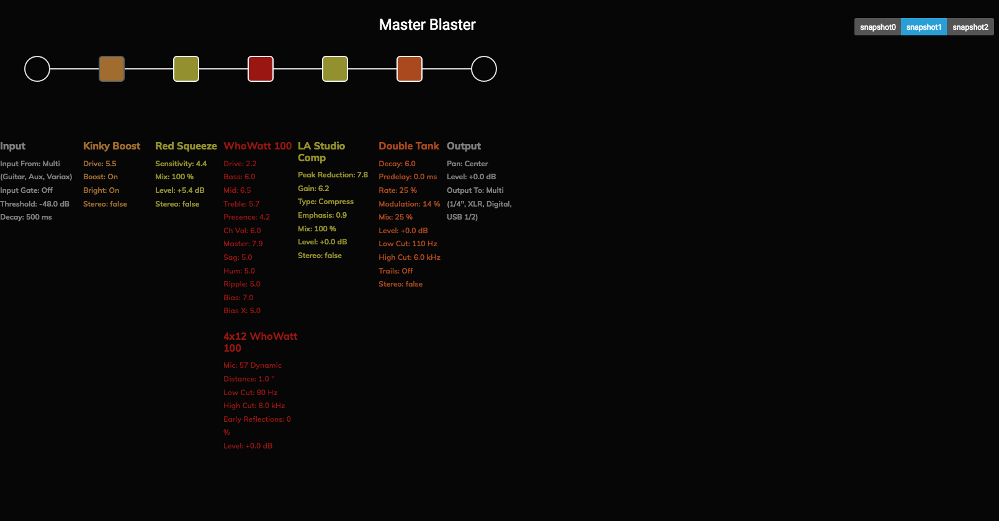

# HX Stomp Patch Library

These are patches we've created for use with the songs taught by Josh Skaja and The System. Learn more about the System [here](http://thesystem.rocks)

## April 2021

### 24k Magic - Bruno Mars

### Beat It - Michael Jackson

### Brain Stew - Green Day

### Call me Maybe - Carly Rae Jepsen

### Day Tripper - The Beatles

### Master Blaster - Stevie Wonder

This patch is based on a Motown/Classic soul patch. We used the powerful 100w Mandarin Rocker, based on the Orange® Rockerverb 100 MKIII (Dirty Channel).
The idea was to use an amp with a lot of headroom so we could emulate the sound of playing into a recording studio console. The saturation and modulation
is provided by the Retro Reel modulation effect which emulates the sound of a reel-to-reel player. The Legacy Plate reverb was chosen to match the style of the time.
[Hear the patch](https://youtu.be/FaH9KgL4AEU)(opens a youtube video.)
[Get the patch](https://raw.githubusercontent.com/vanb/guitaros/master/tones/motown-soul-patch.hlx)

### Message In A Bottle - The Police
